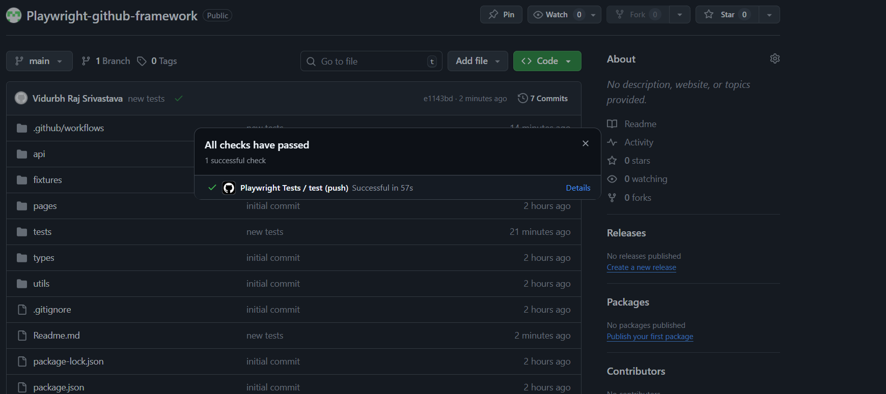

# Playwright Hybrid Automation Framework

A scalable automation framework built using Playwright and TypeScript that validates API responses against UI using a hybrid testing approach.

---

## Overview

This project demonstrates how to build a modern test automation framework that ensures data consistency between backend APIs and frontend UI.

It follows best practices such as:

* Page Object Model (POM)
* Fixtures (Dependency Injection)
* Data-driven testing
* CI/CD integration using GitHub Actions

---

## Architecture

```
API Layer → Fixtures → Page Object Model → Test Layer
```

### API Layer

Handles backend API calls and returns structured data using TypeScript types.

### Fixtures

Provides reusable test setup and injects API data and page objects into tests.

### Page Object Model

Encapsulates UI locators and actions to keep tests clean and maintainable.

### Test Layer

Validates API and UI consistency and contains hybrid and API test scenarios.

---

## Tech Stack

* Playwright
* TypeScript
* GitHub Actions (CI/CD)
* DummyJSON API

---

## Features

* Hybrid testing (API + UI validation)
* Data-driven test execution
* Reusable fixtures for clean setup
* Page Object Model for UI abstraction
* CI/CD pipeline with GitHub Actions
* Video and trace capture for debugging

---

## Test Scenarios

### Hybrid Test

* Fetch product via API
* Render UI dynamically
* Validate UI matches API response

### Negative Test

* Validate API response for invalid product ID

### Search API Test

* Validate search results contain relevant products

---

## Project Structure

```
api/              # API layer
pages/            # Page Objects
fixtures/         # Custom fixtures
tests/            # Test cases
types/            # TypeScript interfaces
playwright.config.ts
```

---

## How to Run Tests

Install dependencies:

```
npm install
```

Run tests:

```
npx playwright test
```

Run in headed mode:

```
npx playwright test --headed
```

---

## CI/CD Integration

This project uses GitHub Actions to:

* Run tests automatically on push
* Generate HTML reports
* Upload artifacts (videos, traces, screenshots)

---

## Sample Output




---

## Key Learnings

* Building scalable automation frameworks
* Implementing hybrid API and UI validation
* Using fixtures for dependency injection
* Debugging tests using Playwright traces
* Integrating CI/CD pipelines

---

## Future Improvements

* Add authentication-based testing
* Environment-based configuration
* Cross-browser execution in CI
* Integration with real-world UI applications

---

## Author

Vidurbh Raj Srivastava
